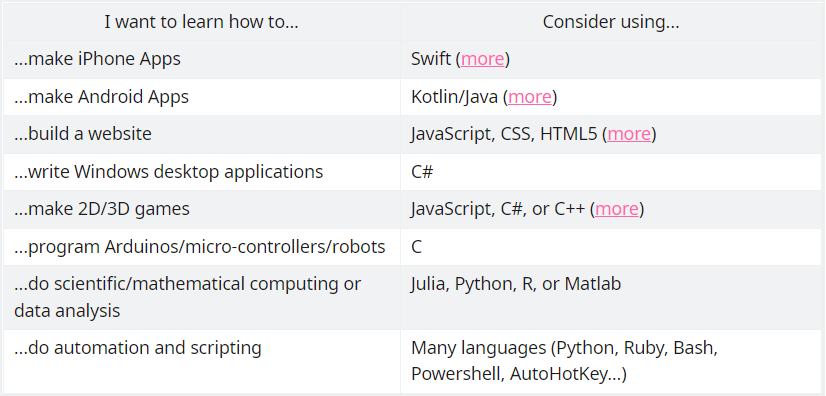

[reference](https://www.reddit.com/r/learnprogramming/wiki/faq)

# Getting Started
### The proper perspective
code to solve the problems.

### Programming language

# How to Improve
### How do I move from a beginning to an intermediate level?
* take a more rigorous intro course
* constant practice 
* decompose problems
* ask for help

### Where can I find practice exercises and project ideas?
* project ideas
* practice exercises

more detail in reference

# Others
### Terminology and Vocab
### Tools and version control