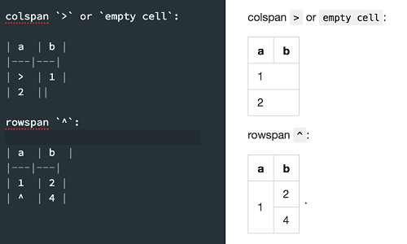

- [Comments](#comments)
- [Emphasis](#emphasis)
- [Lists](#lists)
- [images](#images)
- [Links](#links)
- [Emoji](#emoji)
- [Quotes](#quotes)
- [Horizontal Rule](#horizontal-rule)
- [Summary dropdown](#summary-dropdown)
- [Inline code](#inline-code)
- [Fenced code block](#fenced-code-block)
- [Syntax Highlighting](#syntax-highlighting)
- [Task lists](#task-lists)
- [Tables](#tables)
- [Extended syntax In MPE](#extended-syntax-in-mpe)
  - [Tables](#tables-1)
  - [Abbreviation](#abbreviation)
  - [Admonition](#admonition)
  - [Footnotes](#footnotes)

## Comments
<!-- You can not see me! -->

## Emphasis

*This text will be italic*
_This will also be italic_

**This text will be bold**
__This will also be bold__

_You **can** combine them_

~~This text will be strikethrough~~

==marked==

## Lists
Unordered List

- Item 1
- Item 2
  - Item 2a
  - Item 2b
  
Ordered List
1. Item 1
1. Item 2
1. Item 3
   1. Item 3a
   2. Item 3b

## images


## Links
[Latex in md](https://orangex4.cool/post/notes-in-markdown/#%E6%95%B0%E5%AD%A6%E5%85%AC%E5%BC%8F%E6%94%AF%E6%8C%81)
<!-- https://github.com - automatic! -->

## Emoji
:blush:
[More](https://gist.github.com/rxaviers/7360908)


## Quotes
> First
>> Second
>>> Third

## Horizontal Rule
Three or more...

---

Hyphens

***

Asterisks

___

Underscores

## Summary dropdown
<details>
  <summary>Title</summary>
  Contend here
</details>

## Inline code
I think you should use an
`<addr>` element here instead.

## Fenced code block
You can create fenced code blocks by placing triple backticks ``` before and after the code block.

## Syntax Highlighting
You can add an optional language identifier to enable syntax highlighting in your fenced code block.

For example, to syntax highlight Ruby code:
```ruby
require 'redcarpet'
markdown = Redcarpet.new("Hello World!")
puts markdown.to_html
```

## Task lists
- [x] @mentions, #refs, [links](), **formatting**, and <del>tags</del> supported
- [x] list syntax required (any unordered or ordered list supported)
- [x] this is a complete item
- [ ] this is an incomplete item

## Tables
You can create tables by assembling a list of words and dividing them with hyphens - (for the first row), and then separating each column with a pipe |:

|First Header | Second Header | Third Header|
|:--- | ---:|:---:|
|left | right | middle|
| > | extended syntax | ^ |

## Extended syntax In MPE
### Tables
> Need to enable enableExtendedTableSyntax in extension settings to get it work.


### Abbreviation
*[HTML]: Hyper Text Markup Language
*[W3C]: World Wide Web Consortium
The HTML specification is maintained by the W3C.

### Admonition
!!! note This is the admonition title
    This is the admonition body

### Footnotes
Content [^1]

[^1]: Hi! This is a footnote
