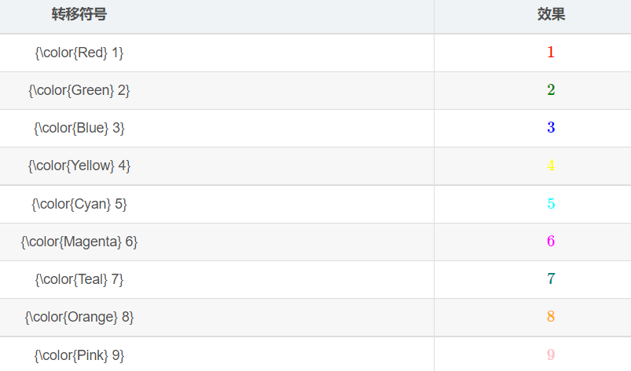

## Common syntax in Latex

---

1. 行内公式: 

$x^2+y^2=1$

2. 公式块:

$$
\begin{cases}
x=\rho\cos\theta \\
y=\rho\sin\theta \\
\end{cases}
$$

3. 上标 $x^2 + y^{12} = 1$

4. 下标 $x_1 + y_{12} = 1$

5. 较小的行内行分数 $\frac{1}{2}$

6. 展示型的分式 $\displaystyle\frac{x+1}{x-1}$

7. 开平方 $\sqrt{2}$

8. 开 $n$ 次方 $\sqrt[n]{2}$

9. 空格

> |名字|效果|
> |----:|:----|
> |紧贴 |$a\!b$|
> |没有空格 |$ab$|
> |小空格 |$a\,b$|
> |中等空格| $a\;b$|
> |大空格 |$a\ b$|
> |quad 空格 |$a\quad b$|
> 两个 quad 空格 |$a\qquad b$|

10. 

> 累加 $\sum_{k=1}^{n+1}\frac{1}{k}  \quad  \displaystyle\sum_{k=1}^n\frac{1}{k}$
> 累乘 $\prod_{k=1}^n\frac{1}{k}  \quad  \displaystyle\prod_{k=1}^n\frac{1}{k}$
> 积分 $\displaystyle \int_0^{2+x}xy{\rm d}x  \quad  \iint_{D_{xy}}{\rm d}x{\rm d}y  \quad  \iiint_{\Omega_{xyz}}$

11. 括号修饰

> 圆括号 $\displaystyle \left(\sum_{k=1}^{n}\frac{1}{k} \right)^2$
> 
> 方括号 $\displaystyle \left[\sum_{k=1}^{n}\frac{1}{k} \right]^2$
> 
> 花括号 $\displaystyle \left\{\sum_{k=1}^{n}\frac{1}{k} \right\}^2$
> 
> 尖括号 $\displaystyle \left\langle\sum_{k=1}^{n}\frac{1}{k} \right\rangle^2$

12. 多行算式对齐

> > 居中:
> > 
> > $$
> > \begin{aligned}
> > y &=(x+5)^2-(x+1)^2 \\
> > &=(x^2+10x+25)-(x^2+2x+1) \\
> > &=8x+24 \\
> > \end{aligned}
> > $$
> 
> > 左对齐:
> > 
> > $
> > \begin{aligned}
> > y &=(x+5)^2-(x+1)^2 \\
> > &=(x^2+10x+25)-(x^2+2x+1) \\
> > &=8x+24 \\
> > \end{aligned}
> > $

13. 方程组

$$
\begin{cases}
k_{11}x_1+k_{12}x_2+\cdots+k_{1n}x_n=b_1 \\
k_{21}x_1+k_{22}x_2+\cdots+k_{2n}x_n=b_2 \\
\cdots \\
k_{n1}x_1+k_{n2}x_2+\cdots+k_{nn}x_n=b_n \\
\end{cases}
$$

14. 矩阵

$$
\begin{pmatrix}
1 & 1 & \cdots & 1 \\
1 & 1 & \cdots & 1 \\
\vdots & \vdots & \ddots & \vdots \\
1 & 1 & \cdots & 1 \\
\end{pmatrix}
$$

$$
\begin{bmatrix}
1 & 1 & \cdots & 1 \\
1 & 1 & \cdots & 1 \\
\vdots & \vdots & \ddots & \vdots \\
1 & 1 & \cdots & 1 \\
\end{bmatrix}
$$ 

$$
\begin{vmatrix}
1 & 1 & \cdots & 1 \\
1 & 1 & \cdots & 1 \\
\vdots & \vdots & \ddots & \vdots \\
1 & 1 & \cdots & 1 \\
\end{vmatrix}
$$

15. 公式编号与引用

$$
x+2 \tag{1.2}
$$

$$
\begin{equation}
x^n+y^n=z^n
\end{equation}
$$

16. 特殊符号

17. 零碎的重要语法

点乘 $\cdot$,

叉乘 $\times$,

异或 $\otimes$,

直和 $\oplus$,

加减 $\pm$,

复合 $\circ$.
小于等于 $\leq$,

大于等于 $\geq$,

不等 $\neq$,

恒等 $\equiv$,

约等 $\approx$,

等价 $\cong$,

相似 $\sim$,

相似等于 $\simeq$,

点等 $\doteq$.
逻辑与 $\land$,

逻辑或 $\lor$,

逻辑非 $\lnot$,

蕴涵 $\to$,

等价 $\leftrightarrow$.

因为 $\because$,

所以 $\therefore$,

存在 $\exist$,

任意 $\forall$.
左小箭头 $\leftarrow$,

右小箭头 $\rightarrow$,

左大箭头 $\Leftarrow$,

右大箭头 $\Rightarrow$,

右长箭头 $\xrightarrow[fgh]{abcde}$.

属于 $\in$,

包含于 $\subset$,

真包含于 $\subseteq$,

交 $\cap$,

并 $\cup$,

空集 $\empty$.

短向量 $\vec{x}$,

长向量 $\overrightarrow{AB}$,

上横线 $\overline{p}$.

无限 $\infty$,

极限 $\lim$,

微分 ${\rm d}$,

偏导 $\partial$,

点求导 $\dot{y}$,

点二阶导 $\ddot{y}$,

变化量 $\Delta$,

梯度 $\nabla$.

横省略 $\cdots$,

竖省略 $\vdots$,

斜省略 $\ddots$.

常见函数  
$\sin$,
$\cos$,
$\tan$,
$\arcsin$,
$\arccos$,
$\arctan$,
$\ln$,
$\log$,
$\exp$.

18.  
${\displaystyle \int f^{-1}(x-x_a)\,dx}$ 
${\textstyle \int f^{-1}(x-x_a)\,dx}$
${\scriptstyle \int f^{-1}(x-x_a)\,dx}$ 
${\scriptscriptstyle \int f^{-1}(x-x_a)\,dx}$

$ \boldsymbol{x} $

