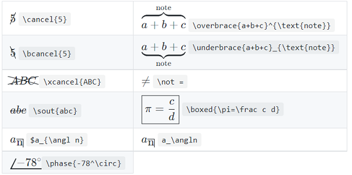
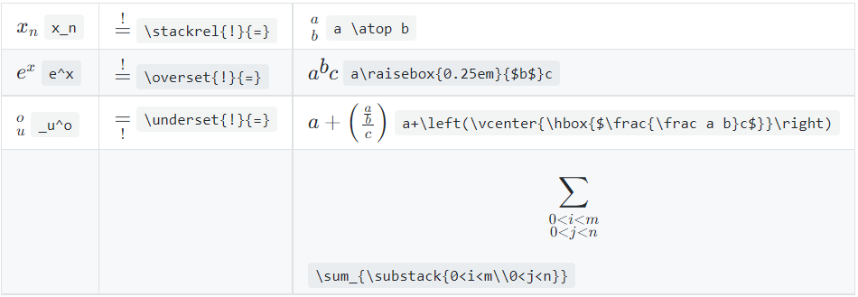

- [KaTex](#katex)
  - [Accents](#accents)
  - [Relations](#relations)
  - [Operators](#operators)
  - [Delimiters](#delimiters)
  - [Letters and Unicode](#letters-and-unicode)
  - [Logic and Set Theory](#logic-and-set-theory)
  - [Symbols and Punctuation](#symbols-and-punctuation)
  - [Environments](#environments)
  - [Layout](#layout)
  - [Style, Color, Size, and Font](#style-color-size-and-font)
- [Reference](#reference)

# KaTex

---

## Accents

## Relations

## Operators

## Delimiters

## Letters and Unicode

## Logic and Set Theory

## Symbols and Punctuation

## Environments
* cases
* array
* matrix

display-mode only
* CD
* align
* equation

|                                             Environments | How they differ from those shown above                                                                                                                           |
| -------------------------------------------------------: | :--------------------------------------------------------------------------------------------------------------------------------------------------------------- |
|                                  darray, dcases, drcases | apply displaystyle                                                                                                                                               |
| matrix*, pmatrix*, bmatrix* Bmatrix*, vmatrix*, Vmatrix* | take an optional argument to set column alignment, as in \begin{matrix*}[r]                                                                                      |
|                      equation*, gather* align*, alignat* | have no automatic numbering.  Alternatively, you can use \nonumber or \notag to omit the numbering for a specific row of the equation.                        |
|                             gathered, aligned, alignedat | do not need to be in display mode.    have no automatic numbering.    must be inside math delimiters in order to be rendered by the auto-render extension. |

## Layout
* Annotation  
  
* Line Breaks
   Hard line breaks are \\\\ and \newline
* Vertical Layout  
  
* Overlap and Spacing  
  * space  
    > |名字|效果|
    > |----:|:----|
    > |紧贴 |$a\!b$|
    > |没有空格 |$ab$|
    > |小空格 |$a\,b$|
    > |中等空格| $a\;b$|
    > |大空格 |$a\ b$|
    > |quad 空格 |$a\quad b$|
    > 两个 quad 空格 |$a\qquad b$|

## Style, Color, Size, and Font

---

# Reference
* [Common Syntax](common-syntax.md)
* [LATEX Mathematical Symbols](src/symbols.pdf)  
* [KATEX](https://katex.org/docs/supported.html)