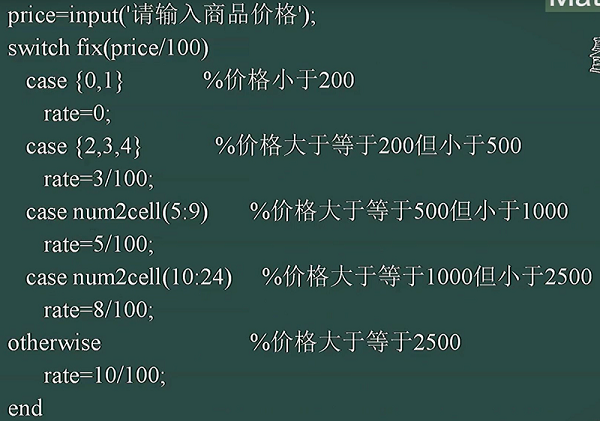
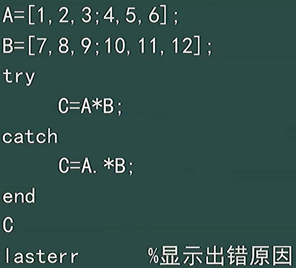
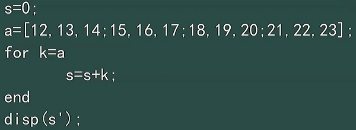
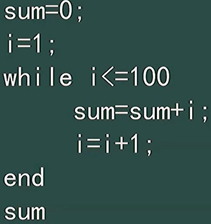
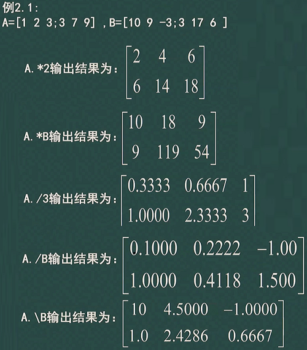

## 条件
① `if`
```m
x=input('input x = ');
if x>0
    y=x+1;
else
    y=x+2;
end
```

② `switch`



③ `try`



## 循环
① `if end`

求矩阵 a 的所有元素之和



② `while end`



③ `break` `continue`

## 矩阵的基本运算
$A+B\qquad A-B\qquad A*B$

==特殊的==

$A/B \iff A*inv(B) \iff A*B^{-1}$

$A\backslash B \iff inv(A)*B \iff A^{-1}*B$

==点运算 $.$ 的定义==

其中 $A B$ 在 $.$ 的作用下只对应元素做运算


