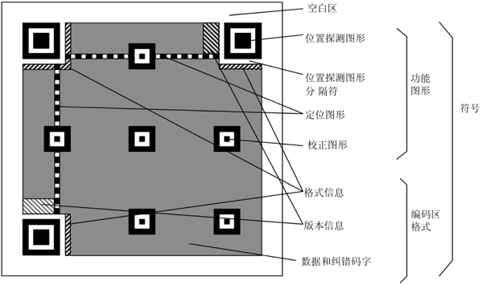
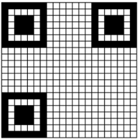
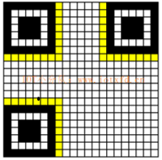
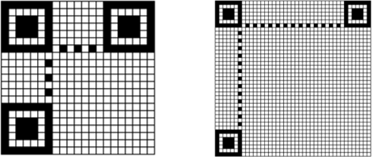
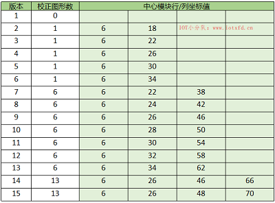
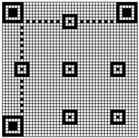
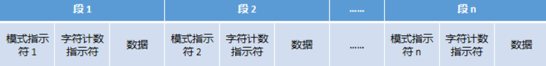
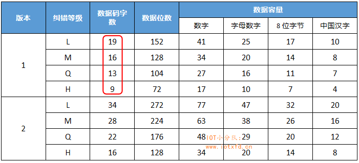

- [QR码的结构](#qr码的结构)
    - [版本](#版本)
    - [寻像图形](#寻像图形)
    - [位置探测图形分隔符](#位置探测图形分隔符)
    - [定位图形](#定位图形)
    - [校正图形](#校正图形)
- [数据编码](#数据编码)
    - [数值模式](#数值模式)
    - [字母数字模式](#字母数字模式)
    - [8 位字节模式](#8-位字节模式)
    - [混合模式](#混合模式)
    - [FNC1 模式](#fnc1-模式)
    - [终止符](#终止符)
    - [位流到码字的转换](#位流到码字的转换)
- [纠错码](#纠错码)
    - [纠错等级](#纠错等级)
    - [纠错码字的生成](#纠错码字的生成)

[Reference](http://article.iotxfd.cn/RFID/BarCode2D)

# QR码的结构
一个 QR 码可以分为两个部分：功能图形和编码区域。

### 版本
不同大小的 QR 码称为**版本**。
> 版本01，大小为 21 x 21 模块。  
> 版本02，大小为 25 x 25 模块。  
> 版本40，大小为 177 x 177 模块。  
> ( 每个版本比以前的版本大4个模块 )
> 
> 模块是绘制最小单位。
> 在绘制 QR 码时，将存在数据的模块填充为深色，最终组成 QR 码图形。

### 寻像图形
寻像图形包括三个相同的**位置探测图形**，分别位于二维码左上角、右上角、左下角，每个位置探测图形由7×7个模块组成。

作用：
* 符号中其他地方遇到类似图形的可能性极小，因此可以在视场中迅速地识别可能的 QR 码符号。
* 识别组成寻像图形的三个位置探测图形，可以明确地确定视场中符号的位置和方向。

### 位置探测图形分隔符
为方便识别**位置探测图形**，在每个位置探测图形和编码区域之间有宽度为 1 个模块的分隔符。此区域应全为空白，不能填入数据。

如下图黄色区域所示。

### 定位图形

作用：
* 确定符号的密度和版本
* 提供决定模块坐标的基准位置。

### 校正图形
每个**校正图形**由5×5模块组成。数量由版本号决定。

下表列出了前14个版本的数据：

> 完整数据请查看国家标准 GB/T 18284-2000 中的附录 E

读表方式：
例如在版本 7 中，表中给出值 6、22、38。

则**校正图形**的中心点位置行、列坐标为 (6,22) (22,6) (22,22) (22,38) (38,22) (38,38) 。（从 0 开始）

说白了就是将**中心模块的行/列坐标值**中的每个值分别与自己及其他值组成坐标，然后删除左上、右上、左下坐标，即得出结果。

作用：
* 作为一个固定的参照图形，在图像有一定程度损坏的情况下，译码软件可以通过它同步图像模块的坐标映像。

---

# 数据编码
将数据的**位流**连接起来并在前面加上**模式指示符**和**字符计数指示符**。得到最终编码。

**模式指示符**
| 模式名称 | 指示符           |
| -------: | :--------------- |
|     数值 | 0001             |
| 字母数字 | 0010             |
| 字节模式 | 0100             |
|     中文 | 1101             |
|     日文 | 1000             |
|  ECI模式 | 0111             |
|     FNC1 | 0101（第一位置） |
|     FNC1 | 1001（第二位置） |

**字符计数指示符**

字符计数指示符表示装载字符的个数，长度随不同的 QR 码版本以及模式而不同。

| 版本\模式    | 数值模式 | 字母数字模式 | 字节模式 | 日文模式 |
| :----------- | :------- | :----------- | :------- | :------- |
| 版本  1 - 9  | 10位     | 9位          | 8位      | 8位      |
| 版本 10 - 26 | 12位     | 11位         | 16位     | 10位     |
| 版本 27 - 40 | 14位     | 13位         | 16位     | 12位     |

例 数值`01234567`位数为 8，查上表数值模式列，如果使用版本 1 来表示，则位数为 10。最终：8 -> 0000001000

### 数值模式

  
数值转化为位流

  将要表示的数值从左边开始每三位分为一组。

  * 将每组数据转换为 10 位二进制（10 位二进制可表示的最大数字为 1023）。
  * 如果最后一组数字只剩两位，则使用 7 位二进制表示（7 位二进制可表示的最大数字为 127）这两个数字。
  * 如果最后一组数字只剩一位，则使用4位二进制表示最后一个数字（4 位二进制可表示的最大数字为 15）。

  例 数值`01234567`：
  1. 分为 3 位一组：012  345  67
  2. 将每组转换为二进制：  
      012 -> 0000001100  
      345 -> 0101011001  
       67 -> 1000011
  3. 将二进制连接为一个序列：0000001100 0101011001 1000011

> 在上述例子中  
> 【模式指示符 + 字符计数指示符 + 数值位流】的方式连接数据最终为：  
> 0001 0000001000 0000001100 0101011001 1000011

### 字母数字模式
| 字符 | 值   |     | 字符 | 值   |     | 字符 | 值   |     | 字符 | 值   |     | 字符 | 值   |
| ---: | :--- | --- | ---: | :--- | --- | ---: | :--- | --- | ---: | :--- | --- | ---: | :--- |
|    0 | 0    |     |    9 | 9    |     |    I | 18   |     |    R | 27   |     |   SP | 36   |
|    1 | 1    |     |    A | 10   |     |    J | 19   |     |    S | 28   |     |    $ | 37   |
|    2 | 2    |     |    B | 11   |     |    K | 20   |     |    T | 29   |     |    % | 38   |
|    3 | 3    |     |    C | 12   |     |    L | 21   |     |    U | 30   |     |    * | 39   |
|    4 | 4    |     |    D | 13   |     |    M | 22   |     |    V | 31   |     |    + | 40   |
|    5 | 5    |     |    E | 14   |     |    N | 23   |     |    W | 32   |     |    - | 41   |
|    6 | 6    |     |    F | 15   |     |    O | 24   |     |    X | 33   |     |    . | 42   |
|    7 | 7    |     |    G | 16   |     |    P | 25   |     |    Y | 34   |     |    / | 43   |
|    8 | 8    |     |    H | 17   |     |    Q | 26   |     |    Z | 35   |     |    : | 44   |

将输入分为两个字符一组，将左边的字符的值乘以 45 与第二个字符的值相加，将所得的结果转换为 11 位二进制数。

如果输入的数据的字符不是 2 的倍数，将最后一个字符编码为 6 位二进制数。

### 8 位字节模式
字符的 ASCII 字符值表示输入。

### 混合模式

> [The best coding rule for bitstream length.](Bitstream%20length.md)

### FNC1 模式
用于标识按特定的行业或应用格式化信息的符号。

[Reference](https://www.cnblogs.com/abatei/p/11655984.html)

### 终止符
数据位流后加终止符序列 0000 。

当数据位流数量正好填满符号容量时，它可以省略；或者当符号所余的容量不足 4 位时它可以截短。

### 位流到码字的转换
数据位流需要按顺序连接在一起，最后添加终止符。

所得的数据位流被分为一个个码字；所有码字长度都是 8 位，如果位流长度最后一个码字不足 8 位，则用二进制值为 0 的填充位填充至 8 位。

例 数值`01234567`：
1. 最终生成的数据位流：  
   0000001100 0101011001 1000011
2. 加入终止符 0000（现在符号容量足够，不用考虑容量不足的情况）：  
    0000001100010101100110000110000
3. 将数据位流划分为码字：  
    00000011,00010101,10011000,0110000
4. 最后一个码字只有 7 位数字，补 1 个零，最终数据变为：  
    00000011,00010101,10011000,01100000
5. 选择版本 1 的 H 纠错等级。在此等级中可放置 9 个码字，还剩余 5 个码字是不能放空的，需要交替填充码字 11101100 和 00010001，直至填满整个 9 个码字：  
    00000011,00010101,10011000,01100000,11101100,00010001,11101100,00010001,11101100

> 部分版本 QR 码的码字容量  
> 完整表格请参考 GB/T 18284-2000  
>      
> 

---

# 纠错码
QR 码采用纠错算法生成一系列**纠错码字**，添加在**数据码字**序列之后，使得符号可以在遇到损坏时可以恢复。

**纠错码字**可以纠正两种类型的错误
  * 拒读错误：没扫描到或无法译码的符号字符（错误码字的位置已知）
  * 替代错误：错误译码的符号字符（错误码字位置未知）

### 纠错等级
|             纠错等级 |    L |    M |    Q |    H |
| -------------------: | ---: | ---: | ---: | ---: |
| 纠错容量(%) (近似值) |    7 |   15 |   25 |   30 |

### 纠错码字的生成
QR 码的纠错使用 [Reed–Solomon](http://article.iotxfd.cn/RFID/Reed%20Solomon%20Codes) 编码

待续。。。

